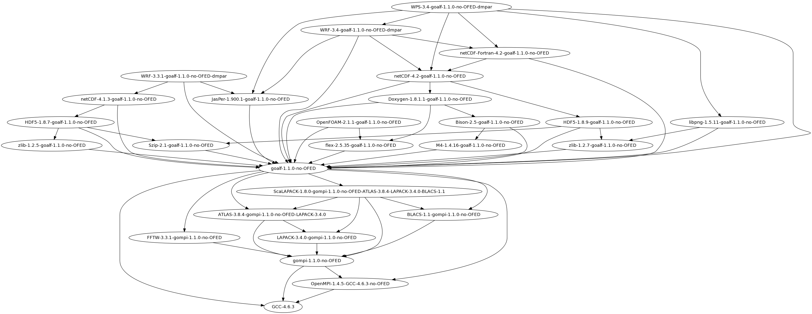

.. _HPCBIOS_2012-92:

HPCBIOS_2012-92: EasyBuild HPC Software Development Environment
===============================================================

.. note::

  EasyBuild HPC Software Development environment allows to build and use Scientific Computing software
  in a consistent and reproducible way: it can manage Software and Modules in a coherent manner.

  Though building HPC software can be done in alternative ways, either manual or structured,
  EasyBuild can incorporate the experience across multiple HPC sites and provides an advanced service,
  which simplistic solutions -such as Makefiles and simple scripts- can never match, since good code
  factorization is necessary in order to tackle the complexity of building software for multiple HPC platforms.

  * BC Policy: HPCBIOS_2012-92
  * Date of Policy: 2012-12-15

The main objective of this policy is to provide EasyBuild, because it allows to:
  * build reproducible and rigorously defined software codes and,
  * have consistent module namespaces across all HPCBIOS resources.

Objective
---------

EasyBuild_ is a tool developed over the course of recent years and has been
released for production use during SuperComputing'12, in Nov. 2012, by the HPC group of Ghent University.

Although other alternatives to EasyBuild could eventually appear in the open,
so far it has been the most self-consistent publicly available tool in yielding
reproducible Scientific Computing environments, transferable across multiple HPC platforms.
Therefore it is considered necessary across HPC sites for both users and systems engineering work.
EasyBuild runs fine in user-space and so, even if it is not provided in a system by default,
users can and will eventually use it.

To be compliant with this policy, an HPC site MUST provide at least one production version of EasyBuild.
This can be done either in the default $PATH or, available via modules (as per ``module load EasyBuild``).
The default provided version MAY be customized as per local needs and SHOULD have out of the box functionality,
as its developers describe in the documentation of the tool.

Example usage
-------------

.. code-block:: sh

  sw@gaia-1:~$ module avail EasyBuild
  
  ------------------------ /opt/apps/HPCBIOS/modules/all -------------------------
  EasyBuild/1.10.0
  EasyBuild/1.11.0

  sw@gaia-1:~$ module load EasyBuild
  sw@gaia-1:~$ eb --version
  == This is EasyBuild 1.6.0
  sw@gaia-1:~$ which eb
  /opt/apps/HPCBIOS.20131224/software/EasyBuild/1.10.0/bin/eb

Example build tree of WRF/WPS & OpenFOAM, along with GCC/OpenMPI & libs
------------------------------------------------------------------------

.. _my-WRF-OpenFOAM-figure:

   Build tree of WRF/WPS & OpenFOAM
   
   **The Weather Research and Forecasting WRF model is a reference code for Weather and Climate communities**.
   You can see how it is built along with its multiple dependent modules, with EasyBuild.
   More details about WRF are visible at WRF_ 's wikipedia page, including further pointers.

WRF & OpenFOAM are prime examples why a tool like EasyBuild is really essential for an HPC site;
not only can it manage the set of dependencies which are necessary,
it will also do so in a manner which is very consistent, eg. in relation to GNU/Intel compilers etc. 
For more detailed information why such documentation of parameters is important, see this issue: EBnWRF_.

Example module namespace
------------------------

A site MAY provide the following list of modules.
There is no need to provide the complete list of the following packages to be in compliance with this policy,
since this is only provided for demonstration of the features and can be customized fully, as per site needs.
Notably, future versions of EasyBuild MAY allow for module categories, alternative versions,
improved integration with environment modules, filtered lists - defined as per user preferences - etc.

.. include:: easybuild_modules.txt
  
References
----------

EasyBuild:  http://hpcugent.github.com/easybuild/

Kindly notify -if this policy is inadequate for your work-
both your local site technical representative & HPCBIOS user-support.

.. _EasyBuild:  http://hpcugent.github.com/easybuild/
.. _WRF:	http://en.wikipedia.org/wiki/Weather_Research_and_Forecasting_model
.. _EBnWRF:     https://github.com/hpcugent/easybuild-framework/issues/140

