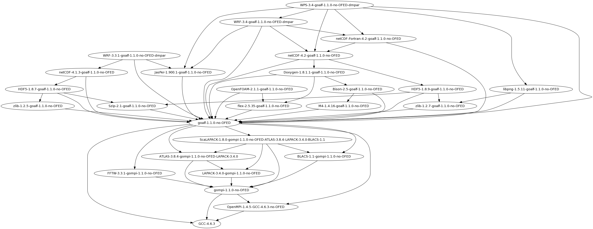

.. _HPCBIOS_2011-92:

HPCBIOS_2011-92: EasyBuild HPC Software Development Environment
===============================================================

.. note::

  EasyBuild Development environment allows to build and use scientific computing software
  in a consistent and reproducible way: It can manage Software and Modules together.
  Though building HPC software can be done in alternative ways, either manual or structured,
  EasyBuild incorporates the experience across multiple HPC centers and provides a service
  that simplistic solutions like Makefiles can never match, since good building 
  code factorization is necessary in order to tackle the complexity of HPC systems.

  * BC Policy: HPCBIOS_2011-92
  * Date of Policy: 1st December 2012

The main objective of this policy is to provide EasyBuild, because it allows:
  * to build reproducible and rigorously defined software codes and,
  * have consistent module namespaces across any HPCBIOS resources.

Objective
---------

EasyBuild_ is a tool developed over the course of last years and released for production use during SC'12, in Nov. 2012, by Univ. of Ghent.

Although other alternatives to EasyBuild could eventually appear,
so far it has been the most consistent tool in yielding
reproducible Scientific Computing environments, transferable across multiple HPC platforms.
Therefor it is considered necessary across HPC sites for both users and sysadmin work.

To be compliant with this policy, an HPC site MUST provide at least one production version of EasyBuild.
This can be done either in the default $PATH or, available via modules (as per ``module load easybuild``).
The default provided version MAY be customized as per local needs and SHOULD have out of the box functionality,
as developers describe in the documentation of the tool.

Example usage
-------------

.. code-block:: sh

  sw@gaia-1:~$ module avail easybuild
  
  ------------------------ /opt/apps/default/modules/all -------------------------
  easybuild/0.9dev              easybuild/1.0rc1
  easybuild/1.0-uni.lu(default) easybuild/1.0rc1-uni.lu

  sw@gaia-1:~$ module load easybuild
  sw@gaia-1:~$ eb -version
  == This is EasyBuild 1.0
  sw@gaia-1:~$ which eb
  /opt/apps/default/software/easybuild/1.0/eb

Example build tree of WRF
-------------------------

   **The Weather Research and Forecasting WRF model is a reference code for Weather and Climate communities**.
   You can see how it is built along with its multiple dependent modules, with EasyBuild.

More details are visible at WRF_ 's wikipedia page, including further pointers.

Example module namespace
------------------------

There is no need to provide the complete list of the following packages to be in compliance with this policy,
this only provided for demonstration of the features of the tool.

.. code-block:: sh

  sw@gaia-1:~$ module avail
  
  ------------- /opt/apps/testing/fgeorgatos/easybuild/modules/all --------------
  AMOS/3.1.0-goalf-1.1.0-no-OFED
  ASE/3.6.0.2515-goalf-1.1.0-no-OFED-Python-2.7.3
  ATLAS/3.8.4-gompi-1.1.0-no-OFED-LAPACK-3.4.0
  Armadillo/2.4.4-goalf-1.1.0-no-OFED-Python-2.7.3
  BLACS/1.1-gompi-1.1.0-no-OFED
  BWA/0.6.2-goalf-1.1.0-no-OFED
  Boost/1.49.0-goalf-1.1.0-no-OFED-Python-2.7.3
  Boost/1.51.0-goalf-1.1.0-no-OFED-Python-2.7.3
  Bowtie2/2.0.0-beta7-goalf-1.1.0-no-OFED
  CGAL/4.0-goalf-1.1.0-no-OFED-Python-2.7.3
  CMake/2.8.4-goalf-1.1.0-no-OFED
  CVXOPT/1.1.5-goalf-1.1.0-no-OFED-Python-2.7.3
  ClustalW2/2.1-goalf-1.1.0-no-OFED
  Cython/0.16-goalf-1.1.0-no-OFED-Python-2.7.3
  Docutils/0.9.1-goalf-1.1.0-no-OFED-Python-2.7.3
  Eigen/3.1.1-goalf-1.1.0-no-OFED
  FFC/1.0.0-goalf-1.1.0-no-OFED-Python-2.7.3
  FFTW/3.3.1-gompi-1.1.0-no-OFED
  FIAT/1.0.0-goalf-1.1.0-no-OFED-Python-2.7.3
  FSL/4.1.9-goalf-1.1.0-no-OFED
  GCC/4.6.3
  GEOS/3.3.5-goalf-1.1.0-no-OFED
  GMP/5.0.5-goalf-1.1.0-no-OFED
  GPAW/0.9.0.8965-goalf-1.1.0-no-OFED-Python-2.7.3
  GSL/1.15-goalf-1.1.0-no-OFED
  HDF5/1.8.7-goalf-1.1.0-no-OFED
  HDF5/1.8.7-goalf-1.1.0-no-OFED-parallel
  HDF5/1.8.9-goalf-1.1.0-no-OFED
  HPL/2.0-goalf-1.1.0-no-OFED
  Harminv/1.3.1-goalf-1.1.0-no-OFED
  Hypre/2.8.0b-goalf-1.1.0-no-OFED
  Infernal/1.1rc1-goalf-1.1.0-no-OFED
  Instant/1.0.0-goalf-1.1.0-no-OFED-Python-2.7.3
  JasPer/1.900.1-goalf-1.1.0-no-OFED
  Jinja2/2.6-goalf-1.1.0-no-OFED-Python-2.7.3
  LAPACK/3.4.0-gompi-1.1.0-no-OFED
  Libint/1.1.4-goalf-1.1.0-no-OFED
  METIS/4.0.1-goalf-1.1.0-no-OFED
  METIS/5.0.2-goalf-1.1.0-no-OFED
  MPFR/3.1.0-goalf-1.1.0-no-OFED
  MTL4/4.0.8878
  MUMmer/3.23-goalf-1.1.0-no-OFED
  Meep/1.2-goalf-1.1.0-no-OFED
  Mercurial/2.3.2-goalf-1.1.0-no-OFED-Python-2.7.3
  MetaVelvet/1.2.01-goalf-1.1.0-no-OFED
  MrBayes/3.1.2-goalf-1.1.0-no-OFED
  OpenFOAM/2.1.1-goalf-1.1.0-no-OFED
  OpenMPI/1.4.5-GCC-4.6.3-no-OFED
  OpenSSL/1.0.0-goalf-1.1.0-no-OFED
  PAPI/5.0.1-goalf-1.1.0-no-OFED
  PCRE/8.12-goalf-1.1.0-no-OFED
  PETSc/3.3-p2-goalf-1.1.0-no-OFED-Python-2.7.3
  ParMETIS/3.1.1-goalf-1.1.0-no-OFED
  ParMETIS/4.0.2-goalf-1.1.0-no-OFED
  Primer3/2.3.0-goalf-1.1.0-no-OFED
  Python/2.7.3-goalf-1.1.0-no-OFED
  Python/3.2.3-goalf-1.1.0-no-OFED
  RNAz/2.1-goalf-1.1.0-no-OFED
  SAMtools/0.1.18-goalf-1.1.0-no-OFED
  SCOTCH/5.1.12b_esmumps-goalf-1.1.0-no-OFED
  SHRiMP/2.2.3-goalf-1.1.0-no-OFED
  SOAPdenovo/1.05-goalf-1.1.0-no-OFED
  SWIG/2.0.4-goalf-1.1.0-no-OFED-Python-2.7.3
  ScaLAPACK/1.8.0-gompi-1.1.0-no-OFED-ATLAS-3.8.4-LAPACK-3.4.0-BLACS-1.1
  ScientificPython/2.8-goalf-1.1.0-no-OFED-Python-2.7.3
  Shapely/1.2.15-goalf-1.1.0-no-OFED-Python-2.7.3
  Sphinx/1.1.3-goalf-1.1.0-no-OFED-Python-2.7.3
  SuiteSparse/3.7.0-goalf-1.1.0-no-OFED-withparmetis
  Szip/2.1-goalf-1.1.0-no-OFED
  Theano/0.5.0-goalf-1.1.0-no-OFED-Python-2.7.3
  Trilinos/10.12.2-goalf-1.1.0-no-OFED-Python-2.7.3
  UFC/2.0.5-goalf-1.1.0-no-OFED-Python-2.7.3
  UFL/1.0.0-goalf-1.1.0-no-OFED-Python-2.7.3
  Velvet/1.2.07-goalf-1.1.0-no-OFED
  ViennaRNA/2.0.7-goalf-1.1.0-no-OFED
  Viper/1.0.0-goalf-1.1.0-no-OFED-Python-2.7.3
  WPS/3.3.1-goalf-1.1.0-no-OFED-dmpar
  WRF/3.3.1-goalf-1.1.0-no-OFED-dmpar
  byacc/20120526-goalf-1.1.0-no-OFED
  bzip2/1.0.6-goalf-1.1.0-no-OFED
  expat/2.1.0-goalf-1.1.0-no-OFED
  flex/2.5.35-goalf-1.1.0-no-OFED
  freetype/2.4.10-goalf-1.1.0-no-OFED
  g2lib/1.2.4-goalf-1.1.0-no-OFED
  git/1.7.12-goalf-1.1.0-no-OFED
  glproto/1.4.16-goalf-1.1.0-no-OFED
  goalf/1.1.0-no-OFED
  gompi/1.1.0-no-OFED
  guile/1.8.8-goalf-1.1.0-no-OFED
  h5py/2.0.1-goalf-1.1.0-no-OFED-Python-2.7.3-parallel
  libctl/3.2.1-goalf-1.1.0-no-OFED
  libffi/3.0.11-goalf-1.1.0-no-OFED
  libpng/1.5.10-goalf-1.1.0-no-OFED
  libpng/1.5.11-goalf-1.1.0-no-OFED
  libpng/1.5.13-goalf-1.1.0-no-OFED
  libpthread-stubs/0.3-goalf-1.1.0-no-OFED
  libreadline/6.2-goalf-1.1.0-no-OFED
  libtool/2.4.2-goalf-1.1.0-no-OFED
  libunistring/0.9.3-goalf-1.1.0-no-OFED
  libxcb/1.8-goalf-1.1.0-no-OFED-Python-2.7.3
  libxml2/2.8.0-goalf-1.1.0-no-OFED
  libxml2/2.8.0-goalf-1.1.0-no-OFED-Python-2.7.3
  makedepend/1.0.4-goalf-1.1.0-no-OFED
  matplotlib/1.1.1-goalf-1.1.0-no-OFED-Python-2.7.3
  ncurses/5.9-goalf-1.1.0-no-OFED
  netCDF/4.1.3-goalf-1.1.0-no-OFED
  petsc4py/3.3-goalf-1.1.0-no-OFED-Python-2.7.3
  pkg-config/0.27.1-goalf-1.1.0-no-OFED
  python-meep/1.4.2-goalf-1.1.0-no-OFED-Python-2.7.3
  setuptools/0.6c11-goalf-1.1.0-no-OFED-Python-2.7.3
  xcb-proto/1.7-goalf-1.1.0-no-OFED-Python-2.7.3
  xproto/7.0.23-goalf-1.1.0-no-OFED
  zlib/1.2.5-goalf-1.1.0-no-OFED
  zlib/1.2.7-goalf-1.1.0-no-OFED

References
----------

EasyBuild:  http://hpcugent.github.com/easybuild/

Kindly notify -if this policy is inadequate for your work-
both your local site technical representative & HPCBIOS user-support.

.. _EasyBuild:  http://hpcugent.github.com/easybuild/
.. _WRF:	http://en.wikipedia.org/wiki/Weather_Research_and_Forecasting_model

