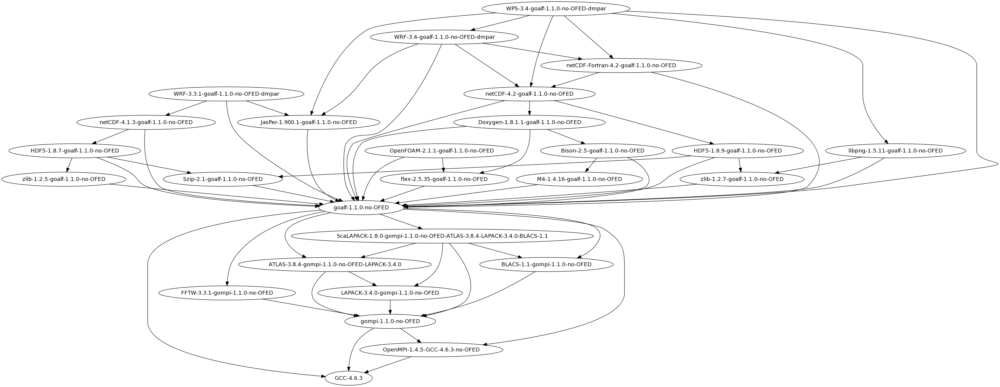

.. _HPCBIOS_2012-92:

HPCBIOS_2012-92: EasyBuild HPC Software Development Environment
===============================================================

.. note::

  EasyBuild HPC Software Development environment allows to build and use Scientific Computing software
  in a consistent and reproducible way: It can manage Software and Modules in a consistent manner.
  Though building HPC software can be done in alternative ways, either manual or structured,
  EasyBuild can incorporate the experience across multiple HPC sites and provides an advanced service,
  which simplistic solutions -such as Makefiles and simple scripts- can never match, since good
  code factorization is necessary in order to tackle the complexity of building software for multiple HPC platforms.

  * BC Policy: HPCBIOS_2012-92
  * Date of Policy: 2012-12-15

The main objective of this policy is to provide EasyBuild, because it allows to:
  * build reproducible and rigorously defined software codes and,
  * have consistent module namespaces across all HPCBIOS resources.

Objective
---------

EasyBuild_ is a tool developed over the course of recent years and has been
released for production use during SuperComputing'12, in Nov. 2012, by the HPC group of University of Ghent.

Although other alternatives to EasyBuild could eventually appear,
so far it has been the most consistent tool in yielding
reproducible Scientific Computing environments, transferable across multiple HPC platforms.
Therefor it is considered necessary across HPC sites for both users and sysadmin work.
EasyBuild runs fine in user-space so even if it is not provided it by default,
users can and will eventually use it.

To be compliant with this policy, an HPC site MUST provide at least one production version of EasyBuild.
This can be done either in the default $PATH or, available via modules (as per ``module load easybuild``).
The default provided version MAY be customized as per local needs and SHOULD have out of the box functionality,
as its developers describe in the documentation of the tool.

Example usage
-------------

.. code-block:: sh

  sw@gaia-1:~$ module avail easybuild
  
  ------------------------ /opt/apps/default/modules/all -------------------------
  easybuild/0.9dev              easybuild/1.0rc1
  easybuild/1.0-uni.lu(default) easybuild/1.0rc1-uni.lu

  sw@gaia-1:~$ module load easybuild
  sw@gaia-1:~$ eb --version
  == This is EasyBuild 1.0
  sw@gaia-1:~$ which eb
  /opt/apps/default/software/easybuild/1.0/eb

Example build tree of WRF
-------------------------

   **The Weather Research and Forecasting WRF model is a reference code for Weather and Climate communities**.
   You can see how it is built along with its multiple dependent modules, with EasyBuild.

WRF is a prime example why a tool like EasyBuild is essential for an HPC site;
not only can it manage the set of dependencies which are necessary,
it will also do so in a manner which is very consistent, eg. in relation to GNU/Intel compilers etc. See EBnWRF_.

More details about WRF are visible at WRF_ 's wikipedia page, including further pointers.

Example module namespace
------------------------

A site MAY provide the following list of modules.
There is no need to provide the complete list of the following packages to be in compliance with this policy,
since this is only provided for demonstration of the features and can be customized as per site needs.
Notably, future versions of EasyBuild are expected to allow for module categories, alternative versions,
improved integration with environment modules, filtered lists - defined as per user preferences - etc.

.. code-block:: sh

  sw@gaia-1:~$ module avail
  
  ------------- /opt/apps/testing/fgeorgatos/easybuild/modules/all --------------
  AMOS/3.1.0-goalf-1.1.0
  ASE/3.6.0.2515-goalf-1.1.0-Python-2.7.3
  ATLAS/3.8.4-gompi-1.1.0-LAPACK-3.4.0
  Armadillo/2.4.4-goalf-1.1.0-Python-2.7.3
  BLACS/1.1-gompi-1.1.0
  BWA/0.6.2-goalf-1.1.0
  Boost/1.49.0-goalf-1.1.0-Python-2.7.3
  Boost/1.51.0-goalf-1.1.0-Python-2.7.3
  Bowtie2/2.0.2-goalf-1.1.0
  CGAL/4.0-goalf-1.1.0-Python-2.7.3
  CMake/2.8.4-goalf-1.1.0
  CVXOPT/1.1.5-goalf-1.1.0-Python-2.7.3
  ClustalW2/2.1-goalf-1.1.0
  Cython/0.16-goalf-1.1.0-Python-2.7.3
  Docutils/0.9.1-goalf-1.1.0-Python-2.7.3
  Eigen/3.1.1-goalf-1.1.0
  FFC/1.0.0-goalf-1.1.0-Python-2.7.3
  FFTW/3.3.1-gompi-1.1.0
  FIAT/1.0.0-goalf-1.1.0-Python-2.7.3
  FSL/4.1.9-goalf-1.1.0
  GCC/4.6.3
  GEOS/3.3.5-goalf-1.1.0
  GMP/5.0.5-goalf-1.1.0
  GPAW/0.9.0.8965-goalf-1.1.0-Python-2.7.3
  GSL/1.15-goalf-1.1.0
  HDF5/1.8.7-goalf-1.1.0
  HDF5/1.8.7-goalf-1.1.0-parallel
  HDF5/1.8.9-goalf-1.1.0
  HPL/2.0-goalf-1.1.0
  Harminv/1.3.1-goalf-1.1.0
  Hypre/2.8.0b-goalf-1.1.0
  Infernal/1.1rc1-goalf-1.1.0
  Instant/1.0.0-goalf-1.1.0-Python-2.7.3
  JasPer/1.900.1-goalf-1.1.0
  Jinja2/2.6-goalf-1.1.0-Python-2.7.3
  LAPACK/3.4.0-gompi-1.1.0
  Libint/1.1.4-goalf-1.1.0
  METIS/4.0.1-goalf-1.1.0
  METIS/5.0.2-goalf-1.1.0
  MPFR/3.1.0-goalf-1.1.0
  MTL4/4.0.8878
  MUMmer/3.23-goalf-1.1.0
  Meep/1.2-goalf-1.1.0
  Mercurial/2.3.2-goalf-1.1.0-Python-2.7.3
  MetaVelvet/1.2.01-goalf-1.1.0
  MrBayes/3.1.2-goalf-1.1.0
  OpenFOAM/2.1.1-goalf-1.1.0
  OpenMPI/1.4.5-GCC-4.6.3
  OpenSSL/1.0.0-goalf-1.1.0
  PAPI/5.0.1-goalf-1.1.0
  PCRE/8.12-goalf-1.1.0
  PETSc/3.3-p2-goalf-1.1.0-Python-2.7.3
  ParMETIS/3.1.1-goalf-1.1.0
  ParMETIS/4.0.2-goalf-1.1.0
  Primer3/2.3.0-goalf-1.1.0
  Python/2.7.3-goalf-1.1.0
  Python/3.2.3-goalf-1.1.0
  RNAz/2.1-goalf-1.1.0
  SAMtools/0.1.18-goalf-1.1.0
  SCOTCH/5.1.12b_esmumps-goalf-1.1.0
  SHRiMP/2.2.3-goalf-1.1.0
  SOAPdenovo/1.05-goalf-1.1.0
  SWIG/2.0.4-goalf-1.1.0-Python-2.7.3
  ScaLAPACK/1.8.0-gompi-1.1.0-ATLAS-3.8.4-LAPACK-3.4.0-BLACS-1.1
  ScientificPython/2.8-goalf-1.1.0-Python-2.7.3
  Shapely/1.2.15-goalf-1.1.0-Python-2.7.3
  Sphinx/1.1.3-goalf-1.1.0-Python-2.7.3
  SuiteSparse/3.7.0-goalf-1.1.0-withparmetis
  Szip/2.1-goalf-1.1.0
  Theano/0.5.0-goalf-1.1.0-Python-2.7.3
  Trilinos/10.12.2-goalf-1.1.0-Python-2.7.3
  UFC/2.0.5-goalf-1.1.0-Python-2.7.3
  UFL/1.0.0-goalf-1.1.0-Python-2.7.3
  Velvet/1.2.07-goalf-1.1.0
  ViennaRNA/2.0.7-goalf-1.1.0
  Viper/1.0.0-goalf-1.1.0-Python-2.7.3
  WPS/3.3.1-goalf-1.1.0-dmpar
  WRF/3.3.1-goalf-1.1.0-dmpar
  byacc/20120526-goalf-1.1.0
  bzip2/1.0.6-goalf-1.1.0
  expat/2.1.0-goalf-1.1.0
  flex/2.5.35-goalf-1.1.0
  freetype/2.4.10-goalf-1.1.0
  g2lib/1.2.4-goalf-1.1.0
  git/1.7.12-goalf-1.1.0
  glproto/1.4.16-goalf-1.1.0
  goalf/1.1.0
  gompi/1.1.0
  guile/1.8.8-goalf-1.1.0
  h5py/2.0.1-goalf-1.1.0-Python-2.7.3-parallel
  libctl/3.2.1-goalf-1.1.0
  libffi/3.0.11-goalf-1.1.0
  libpng/1.5.10-goalf-1.1.0
  libpng/1.5.11-goalf-1.1.0
  libpng/1.5.13-goalf-1.1.0
  libpthread-stubs/0.3-goalf-1.1.0
  libreadline/6.2-goalf-1.1.0
  libtool/2.4.2-goalf-1.1.0
  libunistring/0.9.3-goalf-1.1.0
  libxcb/1.8-goalf-1.1.0-Python-2.7.3
  libxml2/2.8.0-goalf-1.1.0
  libxml2/2.8.0-goalf-1.1.0-Python-2.7.3
  makedepend/1.0.4-goalf-1.1.0
  matplotlib/1.1.1-goalf-1.1.0-Python-2.7.3
  ncurses/5.9-goalf-1.1.0
  netCDF/4.1.3-goalf-1.1.0
  petsc4py/3.3-goalf-1.1.0-Python-2.7.3
  pkg-config/0.27.1-goalf-1.1.0
  python-meep/1.4.2-goalf-1.1.0-Python-2.7.3
  setuptools/0.6c11-goalf-1.1.0-Python-2.7.3
  xcb-proto/1.7-goalf-1.1.0-Python-2.7.3
  xproto/7.0.23-goalf-1.1.0
  zlib/1.2.5-goalf-1.1.0
  zlib/1.2.7-goalf-1.1.0

References
----------

EasyBuild:  http://hpcugent.github.com/easybuild/

Kindly notify -if this policy is inadequate for your work-
both your local site technical representative & HPCBIOS user-support.

.. _EasyBuild:  http://hpcugent.github.com/easybuild/
.. _WRF:	http://en.wikipedia.org/wiki/Weather_Research_and_Forecasting_model
.. _EBnWRF:     https://github.com/hpcugent/easybuild-framework/issues/140

